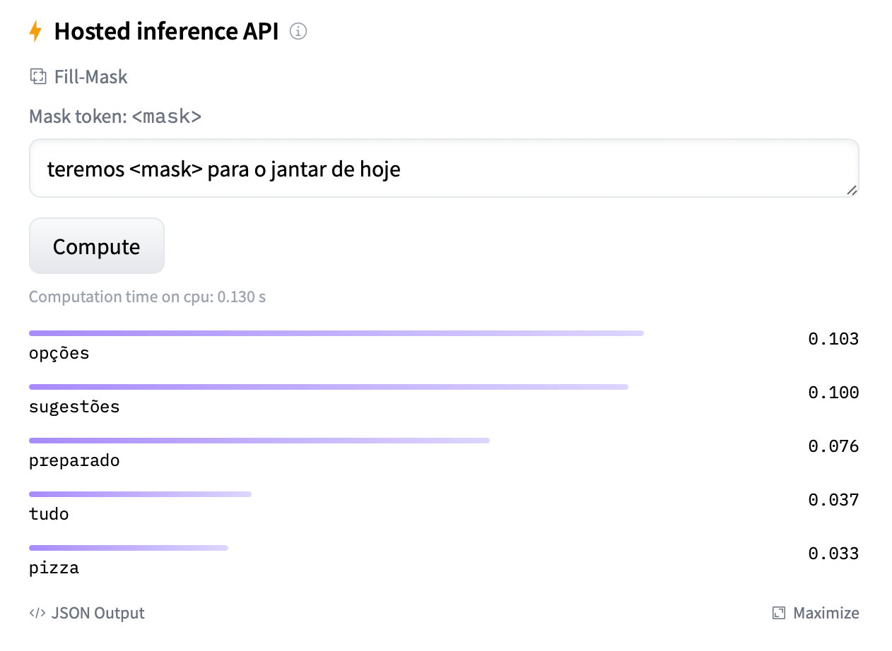
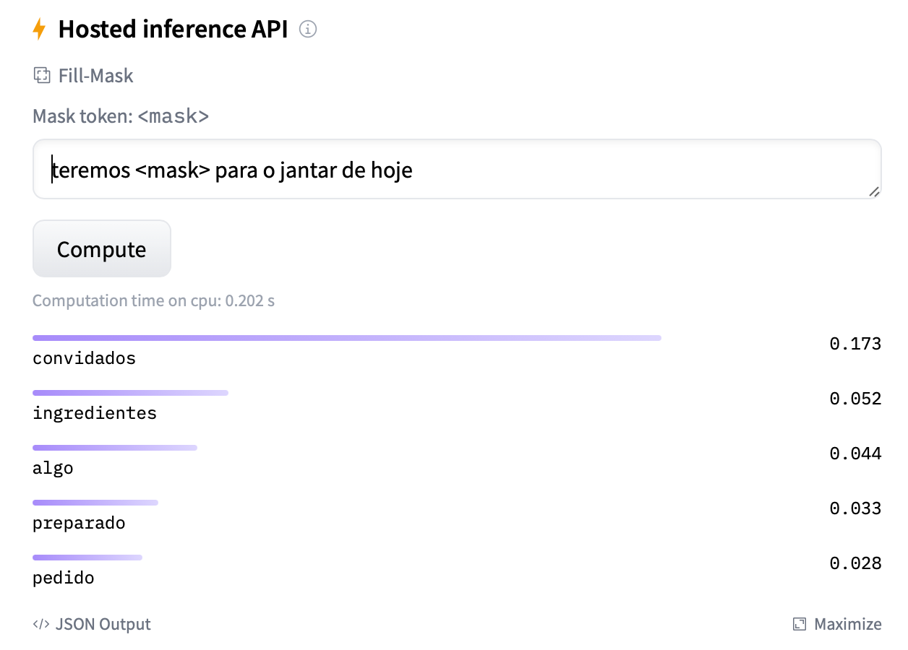

# XLMRoberta Brazilian Portuguese

:uk: English [documentation here](README_en.md)

### Modelo de linguagem

:brazil: documentação em Português do Brasil

Um modelo de linguagem é uma distribuição de probabilidade sobre sequência de palavras. Dada tal sequência de 
comprimento m, um modelo de linguagem atribui uma probabilidade P a toda a sequência. 
Modelos de linguagem geram probabilidades treinando em corpora de texto em um ou vários idiomas 
([Wiki](https://en.wikipedia.org/wiki/Language_model)).

Em termos práticos, um modelo de linguagem é o instrumento utilizado para entender as relações semânticas contidas
em um texto. Na medida em que se apresenta a uma arquitetura diversos textos em uma determinada lingua, o modelo neural
começa a entender a estrutura da linguagem.

Atualmente, uma das mais proeminentes arquiteturas disponíveis para criação de um modelo de linguagem é o 
Bidirectional Encoder Representation From Transformers - BERT. Não é objetivo deste documento explicar o histórico
desse instrumento, mas o leitor pode fazer refência aos seguintes links para entender do que se trata e adquirir o
conhecimento necessário para começar a utilizar modelos de linguagem avançados em sua instituição:

1. [Attention Is All You Need](https://arxiv.org/abs/1706.03762) - Principal artigo que fala da estrutura do mecanismo de atenção
2. [Criação de um modelo de linguagem](https://huggingface.co/course/chapter7/3?fw=tf) - Aqui é possível encontrar uma
documentação mais técnica sobre como construir um modelo. Este documento traz muitos dos conceitos apresentados ali.
Sugiro olhar toda a página já que ela contém diversos bons artigos a respeito do tema.
3. [Getting Started With Google BERT](https://www.amazon.com.br/Getting-Started-Google-BERT-state-ebook/dp/B08LLDF377/ref=sr_1_8?__mk_pt_BR=ÅMÅŽÕÑ&crid=28X93K1JQJHV3&keywords=BERT&qid=1665329915&qu=eyJxc2MiOiIzLjc5IiwicXNhIjoiMy4wNyIsInFzcCI6IjIuNDUifQ%3D%3D&sprefix=bert%2Caps%2C337&sr=8-8&ufe=app_do%3Aamzn1.fos.4bb5663b-6f7d-4772-84fa-7c7f565ec65b) - 
Excelente livro que apresenta os principais conceitos.
4. [Mastering Transformers](https://www.amazon.com.br/Mastering-Transformers-state-art-processing/dp/1801077657/ref=pd_bxgy_img_sccl_2/143-1671141-5155723?pd_rd_w=14lCM&content-id=amzn1.sym.57f5b0c5-8f2e-45a4-8595-2eb0fcbe85cd&pf_rd_p=57f5b0c5-8f2e-45a4-8595-2eb0fcbe85cd&pf_rd_r=CKE76CM6WGY25T4GQ286&pd_rd_wg=qTBxk&pd_rd_r=db15b1e6-cb9d-4a6b-806c-aeac76f1b8ce&pd_rd_i=1801077657&psc=1) - 
Mais um livro que mostra como a estrutura de transformers funciona na prática. Aqui os conceitos de Regularização e
os detalhes da arquitetura são explicados de maneira direta.

As indicações acima estão todas em inglês.

### O que um modelo linguagem faz na prática?

Antes de entrarmos nos detalhes e visualizar a saída de um modelo, vale falar do conceito de Task.

Os modelos neurais são instrumentos que realizam tarefas. Quando estamos falando no nível matemático, o modelo é uma 
descrição de um sistema, uma representação da realidade ([Wiki](https://pt.wikipedia.org/wiki/Modelo_(matemática))). Por
exemplo, podemos escrever um modelo neural cuja função seja maximizar a [similaridade por cosseno](https://pt.wikipedia.org/wiki/Similaridade_por_cosseno).

Esse tipo de declaração pode parecer muito árida para a maioria de nós, mesmo para quem é da área de exatas, computação etc.

Sendo assim, que tarefa o modelo de linguagem executa (de forma simplificada)? A tarefa primária que um modelo de linguagem tenta resolver é 
"Preenchimento de Máscara" ou `fill-mask`. Dado o texto: `teremos <mask> para o jantar de hoje`, o desafio é tentar
encontrar a palavra mascarada.

No inicio do treino de um modelo, ele vai dar diversas opções aleatórias para o termo que deve ser colocado ali, contudo,
com o passar das `épocas` ele vai convergir para uma representação da realidade, ou seja, ele vai `aprender` o que deve
ser usado no lugar de `<mask>`.

À título de curiosidade, o modelo BERT foi treinado com 16Gb de dados da internet, enquanto que o RoBERTa, com mais de 2Tb.

Há diversas arquituras disponíveis oriundas do BERT. A que será utilizada neste estudo será a [XLMRoberta](https://huggingface.co/docs/transformers/model_doc/xlm-roberta). 
XLM vem do fato desse modelo ter sido treinado com o objetivo de atender a diversas línguas, logo, ele pode ser usado
diretamente para uso em divertas ações finalísticas, ou `downstream tasks`.

Se acessarmos o site da Hugginface e irmos até a [página do XLMRobertaBase](https://huggingface.co/xlm-roberta-base) e 
digitarmos nossa frase no campo correspondente para testar o modelo, teremos:

Há ainda uma variação chamada [XLMRobertaLarge](https://huggingface.co/xlm-roberta-large). A mesma frase traz resultados
ligeiramente diferentes:

Isso se dá ao fato que o primeiro teste se deu usando o modelo `base` que possui 12 camadas, já o modelo `large` foi 
treinado com 24 camadas. Para entender melhor o que significam essas camadas, sugirou consultar os documentos informados
ao inicio.

Normalmente os termos modelo e arquitetura são usados conjuntamente, mas o modelo é a implementação da arquitetura, 
sendo assim XLMRoberta é a Arquitetura, XMLRobertaLarge é o modelo. A arquitetura descreve a estratégia de como fazer
o treino, o volume de dados etc, a segunda implementa os conceitos e tem um artefato real disponível para uso.

## Trainando um novo modelo de linguagem

Treinar um novo modelo de linguagem é uma tarefa demorada e de certa forma cara. Todavia, para nós, falantes da língua
portuguesa, os recursos disponíveis para usarmos os modelos atuais são escassos. Há muitas opções para a língua inglesa,
mas quando se trata de NLP, ter um modelo específico para nossa língua faz toda a diferença. Até mesmo o modelo multilíngua
que está sendo usado neste estudo não performa tão bem como um treinado específicamente para o Português falado no Brasil.

Alias, este é um ponto importante já que o volume de dados usado no treino foi classificado automaticamente como sendo texto
em Português, mas sem diferenciar se é o nosso, ou de Portugual. As diferênças semanticas são muitas, por isso a necessidade
de termos um do Brasil.

É importante citar o incrível trabalho realizado pelo pessoal da Neuralmind.ai que criou o primeiro modelo baseado em BERT
em Português do Brasil. A página do [Github deles é esta aqui](https://github.com/neuralmind-ai/portuguese-bert).

Este trabalho vai na mesma linha, mas usando a arquitetura XLMRoberta.

### Dataset e ambiente de treino

O dataset utilizado aqui é o [BrWac](https://www.inf.ufrgs.br/pln/wiki/index.php?title=BrWaC). Para pegar o volume completo
basta entrar em contato com os autores conforme indicado no site. Aqui neste repositório fica disponibilizado uma fração
do dataset apenas para fins educaionais sobre o treinamento de um novo modelo.

Para execução dos trabalhos se utilizou o serviço [Datacrunch.io](http://datacrunch.io/). Até o momento da escrita
deste documento foi o mais em conta encontrado, mas não somente sobre preço, a qualidade das GPUs disponibilizadas é excelente.

Sobre acompanhamento de todo o processo de treinamento se utilizou o [Weights and Bias](http://wandb.ai/).

